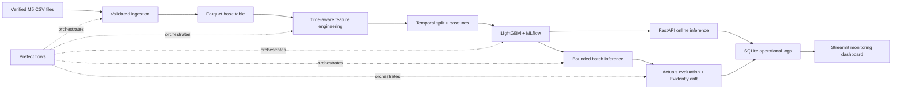

# M5 Retail Demand Forecasting Platform

A reproducible, production-style machine-learning project for 28-day-ahead item/store demand forecasting on Walmart's M5 dataset. It covers validated ingestion, time-aware features, baseline comparison, LightGBM training, MLflow tracking, online and batch inference, monitoring, orchestration, CI, and containerized local deployment.

This repository is a modified educational derivative of [Hariharan-afk/Retail_demand_forecasting_platform](https://github.com/Hariharan-afk/Retail_demand_forecasting_platform). The current revision adds the correctness, reproducibility, testing, documentation, security-hardening, and deployment-verification work described below. The original source and author are explicitly attributed in this README.

This is a portfolio system, not a claim of a production service already operating at retail scale. The [limitations](#limitations) section makes the remaining production work explicit.

## What is working

The following results were reproduced locally from a clean M5 download using the default 120-day resource-conscious configuration:

| Check | Verified result |
|---|---:|
| Raw series | 30,490 item/store combinations |
| Base table | 3,658,800 rows |
| Final feature table | 1,951,360 rows × 65 columns |
| Model inputs | 60 features |
| Training / validation rows | 1,097,640 / 853,720 |
| Best rolling baseline RMSE | 2.3055 |
| LightGBM RMSE | **2.2158** |
| RMSE improvement | **3.89%** |
| LightGBM MAE / bias | 1.0887 / 0.0168 |
| Automated tests | 41 passed |
| Application coverage | 70.57% |
| Runtime checks | API, dashboard, batch, monitoring, Docker Compose |

LightGBM improves the optimized RMSE objective. It does not beat the rolling baseline on every metric; sparse, zero-heavy retail demand makes sMAPE especially harsh. The repository reports all metrics instead of presenting one score as universal model superiority.

## System architecture



Key correctness properties:

- Raw schemas reject missing identifiers, duplicate series/price keys, invalid dates, and negative sales.
- The wide sales file is filtered before melting, keeping memory bounded.
- Sales lags, rolling windows, targets, and validation splits respect time order.
- Prices are forward-filled only; future prices are never backfilled into the past.
- The model bundle persists its exact feature and categorical schema for inference.
- Demand predictions are constrained to non-negative values.
- Parquet/model writes are atomic, batch sizes are bounded, and output names are collision-safe.
- API validation returns safe client errors without exposing internal stack details.

## Quick start

Prerequisites:

- Python 3.11 or 3.12
- [uv](https://docs.astral.sh/uv/getting-started/installation/)
- Git
- About 2 GB of disk space and 8 GB of available RAM for the default profile

```bash
git clone https://github.com/kunalupadhyay70/Retail_demand_forecasting.git
cd Retail_demand_forecasting
cp .env.example .env
uv sync --frozen
make download
make pipeline
```

`make download` fetches the public [M5 Forecasting Accuracy archive](https://zenodo.org/records/12636070), verifies its published MD5 checksum, and extracts only the three required files. It does not overwrite existing raw files unless `--force` is explicitly used.

`make pipeline` runs ingestion, feature engineering, training, a bounded batch forecast, and monitoring. On the verified machine, the largest stage used about 4.7 GB of resident memory. Runtime depends on CPU, disk, and network speed.

## Run the application

Start these in separate terminals after the pipeline has created processed data and a model:

```bash
make api
```

```bash
make dashboard
```

Then open:

- API documentation: <http://127.0.0.1:8001/docs>
- Monitoring dashboard: <http://127.0.0.1:8501>

Verify the running API:

```bash
make smoke
```

The smoke test checks health, loaded model metadata, and a real item/store forecast.

## API examples

Health:

```bash
curl http://127.0.0.1:8001/health
```

Latest available 28-day-ahead forecast:

```bash
curl -X POST http://127.0.0.1:8001/forecast/item-store \
  -H 'Content-Type: application/json' \
  -d '{"item_id":"FOODS_1_001","store_id":"CA_1"}'
```

Request an exact target date:

```bash
curl -X POST http://127.0.0.1:8001/forecast/item-store \
  -H 'Content-Type: application/json' \
  -d '{"item_id":"FOODS_1_001","store_id":"CA_1","forecast_date":"2016-04-24"}'
```

Verified response excerpt:

```json
{
  "item_id": "FOODS_1_001",
  "store_id": "CA_1",
  "feature_row_date": "2016-03-27",
  "target_date": "2016-04-24",
  "forecast_horizon_days": 28,
  "predicted_sales": 1.0566201974925218,
  "model_name": "lightgbm_model"
}
```

The requested target date must have a feature row exactly one configured horizon earlier. Dates that cannot be produced return HTTP 400 instead of silently returning a forecast for another date.

Bounded batch inference:

```bash
curl -X POST http://127.0.0.1:8001/forecast/batch \
  -H 'Content-Type: application/json' \
  -d '{"limit":100}'
```

The default maximum is 1,000 rows and can be reduced through configuration.

## Docker Compose

Processed data and model artifacts are intentionally excluded from image builds. Run the local pipeline first, then mount those outputs into the containers:

```bash
docker compose up --build -d
docker compose ps
uv run python -m scripts.smoke_test
```

Both services have health checks, the dashboard waits for the API, and containers run with an init process. Stop the stack with:

```bash
docker compose down
```

If a Linux Docker daemon cannot resolve package registries on its default build network, correct the daemon DNS configuration. A temporary local verification path is:

```bash
docker build --network=host -f docker/Dockerfile.api \
  -t retail_demand_forecasting_platform-api .
docker build --network=host -f docker/Dockerfile.dashboard \
  -t retail_demand_forecasting_platform-dashboard .
docker compose up -d --no-build
```

## Pipelines and orchestration

Direct commands:

| Command | Purpose |
|---|---|
| `make download` | Download and checksum the raw M5 data |
| `make ingest` | Validate raw data and write the base table |
| `make features` | Build time-aware model features |
| `make train` | Compare baselines, train LightGBM, and log to MLflow |
| `make batch` | Forecast a bounded item/store batch |
| `make monitor` | Evaluate actuals, log quality metrics, and generate drift HTML |
| `make pipeline` | Run the five stages above in sequence |

The full Prefect path includes ingestion and accepts a batch bound:

```bash
uv run python -m scripts.run_flow --flow full --batch-limit 100
```

Individual Prefect flows are available for `ingestion`, `features`, `training`, `batch`, and `monitoring`.

## Data, features, and validation

The source files are:

| File | Role |
|---|---|
| `sales_train_validation.csv` | Daily sales for each item/store series |
| `calendar.csv` | Dates, events, week keys, and SNAP indicators |
| `sell_prices.csv` | Weekly item/store prices |

The 60 model features include:

- Calendar and event context
- Item, store, department, category, and state identifiers
- 1/7/14/28-day sales lags and shifted rolling statistics
- Forward-only price lags, changes, and rolling statistics
- Shifted store/category/department/state aggregate demand

The target is unit demand 28 days after the feature row. Validation is a chronological 28-day holdout; no random split is used.

The default `.env.example` keeps exactly 120 raw history days. This is enough for lag generation, the 28-day target, and validation while remaining practical on an ordinary development machine. Increase `HISTORY_DAYS_FOR_TRAINING` only when the available memory has been assessed; a larger history profile was not used for the verified metrics above.

## Monitoring and outputs

Generated files are ignored by Git and written to:

| Path | Contents |
|---|---|
| `data/processed/` | Base and feature Parquet tables |
| `data/predictions/` | Timestamped batch forecasts |
| `artifacts/models/` | Atomic model bundle and metadata |
| `artifacts/metadata.db` | API, batch, quality, and monitoring history |
| `artifacts/drift_report.html` | Evidently drift report |
| `artifacts/mlflow.db`, `mlruns/` | Experiment metadata and model artifacts |
| `logs/` | Application logs |

Null-cell counts in the dashboard include expected optional event and pre-release price fields. Duplicate counts and required training fields are checked separately.

## Quality gates

```bash
make quality
```

This runs Black's format check, Ruff, mypy, and pytest with a 50% minimum application-coverage gate. The latest full run passed 41 tests at 70.57% coverage. CI repeats these checks on Python 3.11 and 3.12 and builds both Dockerfiles.

See [docs/TESTING.md](docs/TESTING.md) for the test strategy and manual release checks.

## Repository layout

```text
app/
├── api/             FastAPI routes, schemas, and lifecycle
├── config/          Environment-driven settings and logging
├── data/            Ingestion, validation, transformation, storage
├── features/        Calendar, price, lag, hierarchy features
├── inference/       Model loading, schema alignment, online/batch scoring
├── monitoring/      Quality, actuals metrics, alerts, drift
├── orchestration/   Prefect tasks and flows
├── training/        Splits, baselines, evaluation, LightGBM, registration
└── utils/           Paths, timestamps, SQLite helpers
dashboard/           Streamlit monitoring UI
docker/              API and dashboard Dockerfiles
scripts/             Reproducible CLI entry points
tests/               Unit, integration, API, flow, and artifact tests
```

## Limitations

- The bundled data is historical; this repository does not ingest live point-of-sale events.
- The model produces one point forecast at `feature_date + 28 days`, not a recursively generated 28-day trajectory or probabilistic intervals.
- Monitoring evaluates historical batch forecasts against known M5 actuals; it is a realistic backtest, not evidence of live production performance.
- SQLite is appropriate for a local single-node portfolio deployment, not horizontally scaled concurrent writers.
- The API has validation and bounded work but no authentication, authorization, distributed rate limiting, or TLS termination.
- Model selection is a deterministic baseline comparison, not a large hyperparameter search. LightGBM wins on RMSE but not every reported metric.
- Cloud deployment, a feature store, scheduled retraining, and external alert delivery remain future deployment work.

## Resume-ready description

> Extended and validated an existing Walmart M5 demand-forecasting platform by correcting time-series leakage and inference issues, adding reproducible data acquisition, 41 automated tests, CI, container health checks, monitoring, and deployment documentation; processed 1.95M feature rows and improved holdout RMSE by 3.89% over the strongest rolling baseline.

Use only the numbers you can reproduce from your own committed revision and be prepared to explain the temporal split, leakage prevention, sparse-demand metrics, and production limitations in an interview.

## Attribution and redistribution

- Original source: [Hariharan-afk/Retail_demand_forecasting_platform](https://github.com/Hariharan-afk/Retail_demand_forecasting_platform)
- Modified repository: [kunalupadhyay70/Retail_demand_forecasting](https://github.com/kunalupadhyay70/Retail_demand_forecasting)
- The original repository does not currently include an open-source license. This repository therefore does not add or imply a license for the original code.

Obtain permission from the original copyright holder, or ask them to publish the source under a suitable license, before distributing this derivative publicly. Until then, keep the modified repository private. Attribution is required for transparency but does not replace permission.
